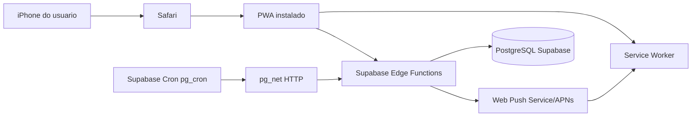
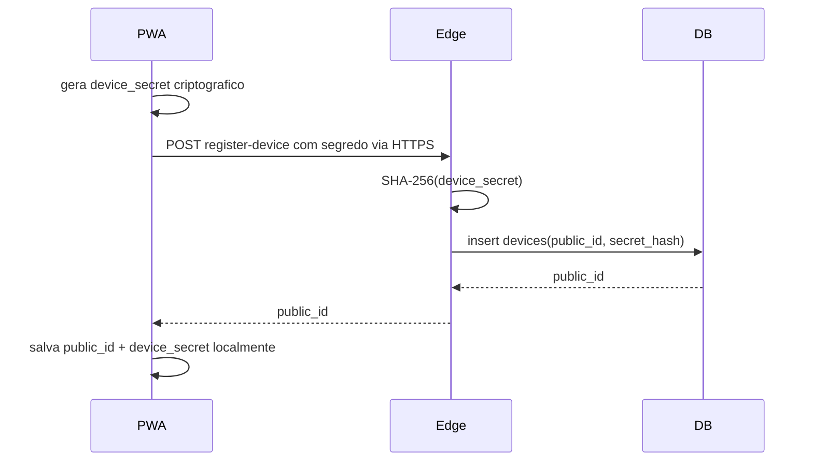
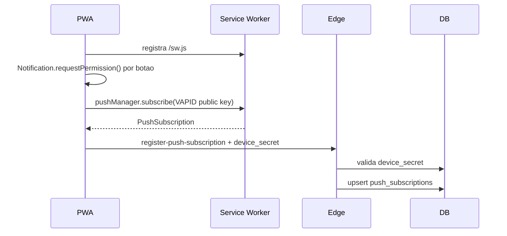
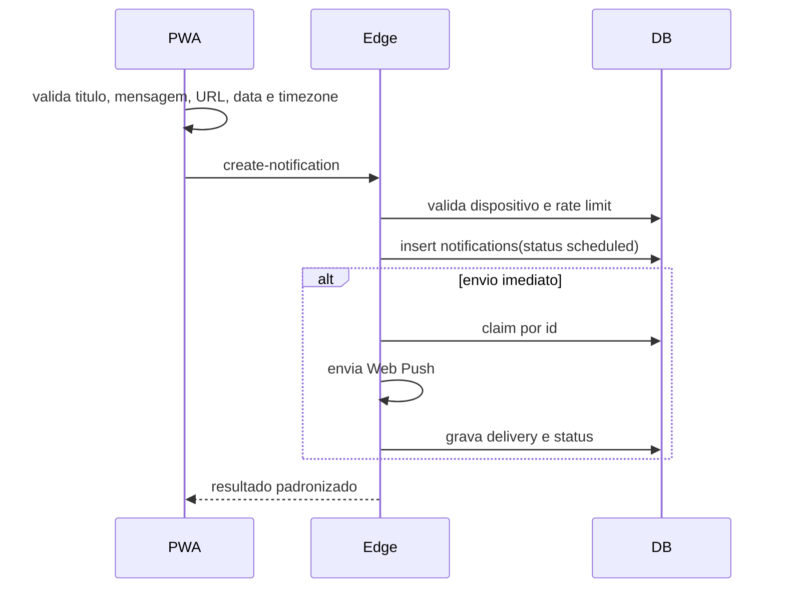
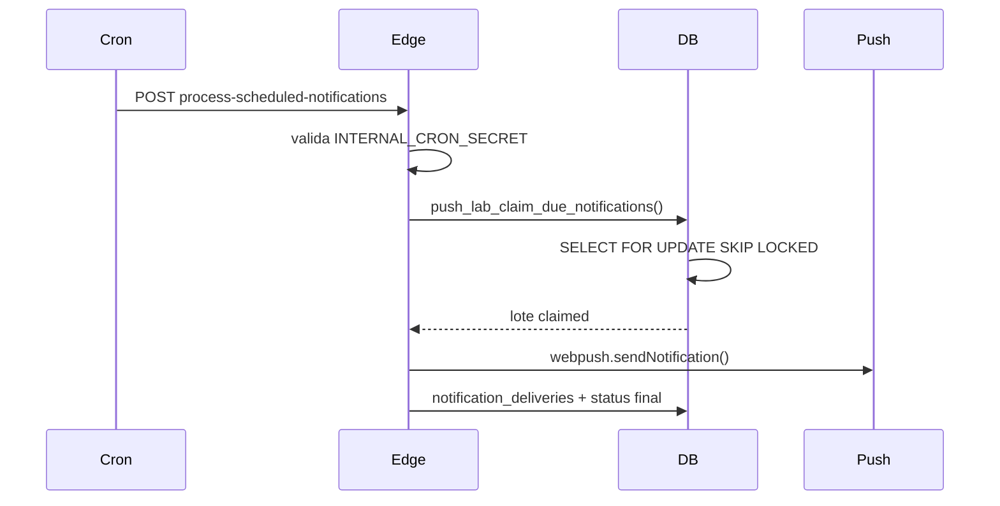
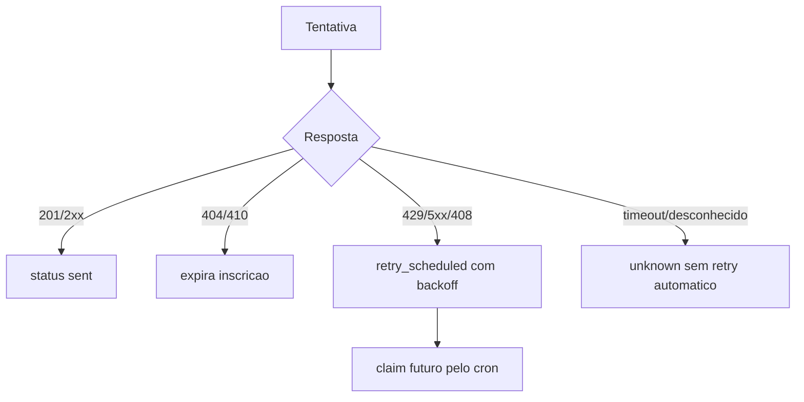
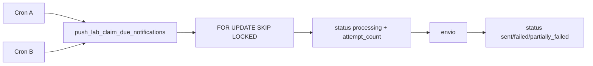
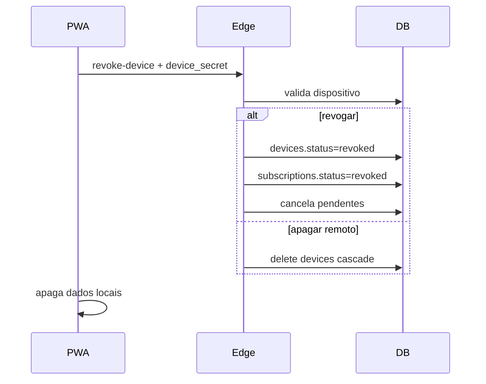
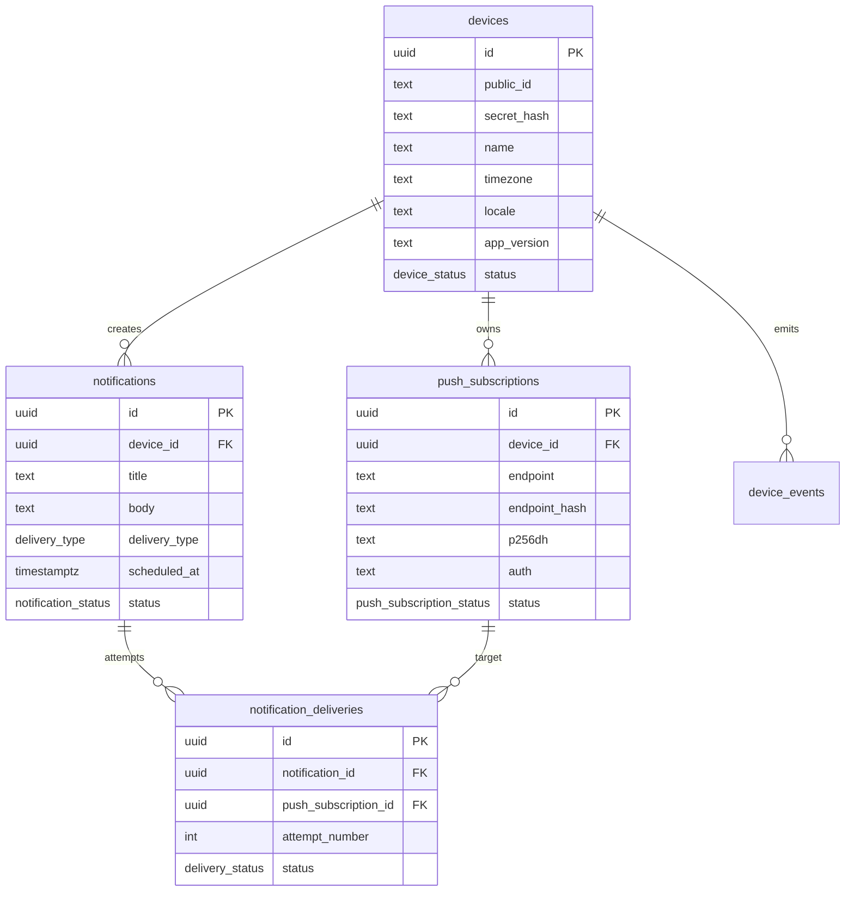

# Arquitetura

## Componentes

## Stack escolhida

- Vite + React + TypeScript: simples para PWA estático e deploy gratuito.
- CSS próprio: evita dependência visual pesada.
- React Hook Form + Zod: validação clara no frontend.
- date-fns/date-fns-tz: conversão local/UTC explícita.
- Supabase Edge Functions + Deno: backend próximo ao Supabase e adequado a endpoints pequenos.
- PostgreSQL: fonte de verdade para dispositivos, inscrições, notificações, entregas, rate limit e auditoria.
- `web-push`: biblioteca madura para VAPID e criptografia de payload Web Push.
- Supabase Cron/pg_cron + pg_net: agenda server-side sem depender do navegador aberto.

## Decisão de agendamento

Escolha: Opção A, Supabase Cron/pg_cron chamando periodicamente uma Edge Function protegida.

Motivos:

- Não depende do PWA aberto.
- Usa recurso oficial do Supabase Cron.
- Permite frequência de 1 minuto.
- Mantém lógica de envio e segredos no backend.
- O claim transacional fica no banco.
- É simples de operar em um projeto pessoal.

Alternativas rejeitadas:

- Opção B: Cron chamando apenas função PostgreSQL. Rejeitada porque a lógica Web Push precisa de VAPID private key e biblioteca de envio; melhor manter em Edge Function.
- Opção C: Cron externo. Mantida como fallback seguro quando pg_cron/pg_net/Vault não estiverem disponíveis.
- Opção D: fila externa/background worker dedicado. Rejeitada por custo/complexidade para uso pessoal.

## Registro do dispositivo

## Registro da inscrição Web Push

## Criação de notificação

## Envio agendado

## Retry

Política:

- 404/410: permanente, inscrição expirada/revogada.
- 429/408/5xx: transitório, retry com backoff limitado.
- Timeout/estado desconhecido: não há retry automático para reduzir risco de duplicidade, porque Web Push não oferece idempotência fim a fim por provedor.
- Máximo padrão: 3 tentativas.

## Idempotência e concorrência

Garantias:

- Execuções simultâneas não reivindicam a mesma notificação graças a `FOR UPDATE SKIP LOCKED`.
- `processing_started_at` permite recuperar tarefas presas.
- `attempt_count` e constraint única em `notification_deliveries` reduzem duplicação por retry.
- Exatamente uma entrega final não pode ser garantida pelo padrão Web Push em caso de timeout após envio parcial; por isso timeouts ficam como `unknown` sem retry automático.

## Revogação

## Modelo de dados

## Timezone

- Frontend converte data/hora local para UTC antes de enviar.
- Banco usa `timestamptz`.
- Interface exibe no timezone do dispositivo.
- Testes cobrem conversão São Paulo e cenário com DST em New York.
- Não há dupla conversão: `scheduled_at` trafega em ISO UTC.

## Riscos

| Risco | Impacto | Probabilidade | Mitigação |
|---|---:|---:|---|
| pg_cron/pg_net indisponível no plano | Alto | Médio | Cron externo protegido |
| iOS ignora imagem/ações | Médio | Alto | Documentar limitação e prévia como simulação |
| Timeout de Web Push com estado desconhecido | Médio | Baixo | Não retry automático para evitar duplicidade |
| Perda de device_secret local | Médio | Médio | Registrar novo dispositivo; revogar antigo se possível |
| Má configuração de CORS/secrets | Alto | Médio | Checklist de deploy e `audit:secrets` |

